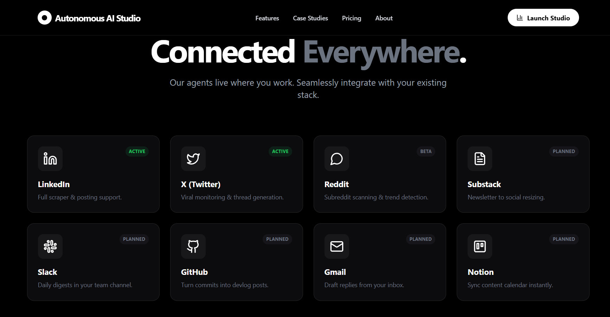
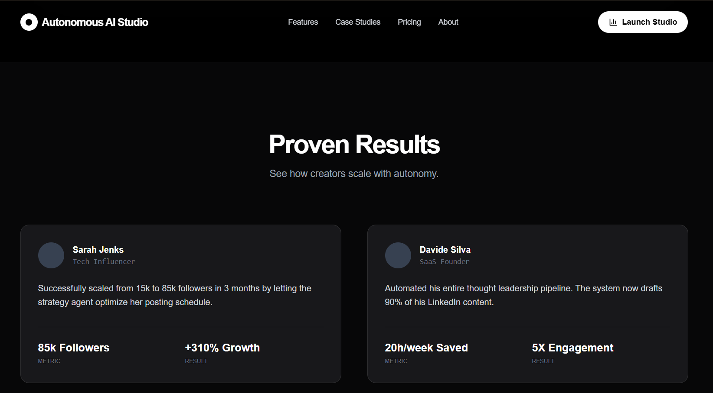

<div align="center">

# 🤖 Autonomous Analytics Studio

### *Beyond Analytics. Pure Intelligence.*

[](https://python.org)
[](https://fastapi.tiangolo.com)
[](https://nextjs.org)
[](https://microsoft.github.io/autogen/)
[](https://ai.google.dev/)

**The first Social Operating System powered by Autonomous AI Agents.**  
Stop staring at fragmented dashboards. Let AI scrape, analyze, and strategize for you.

[🚀 Live Demo](#) • [📖 Documentation](#architecture--flow) • [🐛 Report Bug](https://github.com/issues) • [✨ Request Feature](https://github.com/issues)

</div>

---

## 📸 Screenshots

<!-- Add your screenshots here -->
<div align="center">

### Landing Page


### Social Media Support


### Dashboard - Command Center


### AI Data Pipeline


### Multi-Agent Pipeline Visualization


### Autonomous Features


### Autonomous Agents Output
 

### Data Gathering


### Statistics


### 
</div>

---

## 🎯 Problem Statement

Social media managers and content creators face significant challenges in today's digital landscape:

- **Data Fragmentation**: Analytics scattered across multiple platforms (LinkedIn, Twitter, Instagram)
- **Manual Analysis Burden**: Hours spent manually reviewing metrics and deriving insights
- **Reactive Strategy**: Decisions based on gut feeling rather than data-driven intelligence
- **Scalability Issues**: Unable to process and analyze large volumes of content efficiently
- **Delayed Insights**: Time lag between data collection and actionable recommendations

### The Gap We're Filling

Traditional analytics tools provide **raw numbers**. They tell you *what* happened, but not *why* or *what to do next*. Content creators need a system that:

1. **Autonomously** collects data without manual intervention
2. **Intelligently** analyzes patterns using AI reasoning
3. **Proactively** generates actionable content strategies
4. **Continuously** learns and improves recommendations

---

## 💡 Solution & Use Cases

**Autonomous Analytics Studio** is an AI-powered social media intelligence platform that transforms raw social data into strategic insights through autonomous multi-agent collaboration.

### Primary Use Cases

| Use Case | Description | Target User |
|----------|-------------|-------------|
| **Content Performance Analysis** | AI analyzes post metrics to identify what content resonates with your audience | Content Creators |
| **Trend Detection** | Autonomous agents identify emerging patterns and viral content opportunities | Social Media Managers |
| **Strategy Generation** | AI generates weekly content calendars based on historical performance | Marketing Teams |
| **Engagement Optimization** | Data-driven recommendations for posting times, formats, and topics | Influencers |
| **Competitive Intelligence** | Monitor and analyze competitor content strategies | Brands & Agencies |

### Real-World Scenario

> *"A LinkedIn content creator wants to understand why some posts go viral while others flop. Instead of manually reviewing hundreds of posts, they trigger the Autonomous Analytics Studio. Within seconds, AI agents scrape their latest posts, analyze engagement patterns, and deliver a comprehensive strategy with 5 high-potential content ideas for the next week."*

---

## 🧠 Autonomous & Agentic Nature

### What Makes It Truly Autonomous?

This platform operates on the principle of **"Set and Forget"** automation:

```
┌─────────────────────────────────────────────────────────────────────┐
│                    AUTONOMOUS OPERATION LOOP                        │
├─────────────────────────────────────────────────────────────────────┤
│                                                                     │
│   [1] TRIGGER        [2] SCRAPE         [3] ANALYZE                │
│   ───────────►      ───────────►       ───────────►                │
│   User clicks       Playwright bot     Multi-Agent                  │
│   one button        autonomously       AI reasoning                 │
│                     extracts data                                   │
│                                                                     │
│                      [4] STRATEGIZE     [5] DELIVER                 │
│                     ◄───────────       ◄───────────                 │
│                     Content ideas      Actionable                   │
│                     generated          insights UI                  │
│                                                                     │
└─────────────────────────────────────────────────────────────────────┘
```

### Autonomous Capabilities

| Capability | Implementation | Autonomy Level |
|------------|----------------|----------------|
| **Data Collection** | Playwright-based web scraping with auto-login, CAPTCHA handling, infinite scroll | 🟢 Fully Autonomous |
| **Content Parsing** | Multi-selector fallback system for robust extraction | 🟢 Fully Autonomous |
| **AI Analysis** | Multi-agent collaboration without human intervention | 🟢 Fully Autonomous |
| **Strategy Generation** | LLM-powered content ideation | 🟢 Fully Autonomous |
| **Error Recovery** | Self-healing scraper with retry mechanisms | 🟡 Semi-Autonomous |

---

## 🤝 Multi-Agent Architecture

### Agentic Framework: AutoGen (AG2) + Gemini 2.5 Flash

We leverage **Microsoft's AutoGen framework** with **Google's Gemini 2.5 Flash** to create a collaborative multi-agent system:


```
                    ┌─────────────────────────────────────┐
                    │         ADMIN (User Proxy)          │
                    │   • Initiates analysis tasks        │
                    │   • Approves execution plans        │
                    │   • No code execution (safety)      │
                    └──────────────┬──────────────────────┘
                                   │
                                   │ Task Delegation
                                   ▼
        ┌──────────────────────────────────────────────────────────┐
        │                    AGENT ORCHESTRATION                    │
        ├────────────────────────┬─────────────────────────────────┤
        │                        │                                  │
        ▼                        ▼                                  │
┌───────────────────┐   ┌───────────────────┐                      │
│   🔍 ANALYST      │   │  💡 TREND SPOTTER │                      │
│   AGENT           │   │     AGENT         │                      │
├───────────────────┤   ├───────────────────┤                      │
│ • Analyzes post   │   │ • Identifies      │                      │
│   metrics         │──►│   content trends  │                      │
│ • Identifies      │   │ • Generates       │                      │
│   patterns        │   │   content ideas   │                      │
│ • Engagement      │   │ • Hook structures │                      │
│   insights        │   │ • Topic alignment │                      │
└───────────────────┘   └───────────────────┘                      │
        │                        │                                  │
        └────────────────────────┴──────────────────────────────────┘
                                 │
                                 ▼
                    ┌─────────────────────────────────────┐
                    │      📊 CONSOLIDATED INSIGHTS       │
                    │   Delivered to Dashboard UI         │
                    └─────────────────────────────────────┘
```

### Agent Specifications

| Agent | Role | LLM Config | Key Responsibilities |
|-------|------|------------|---------------------|
| **Admin** | User Proxy | N/A | Task initiation, plan approval, safety oversight |
| **Analyst** | Assistant Agent | Gemini 2.5 Flash | Deep-dive metrics analysis, engagement trends, pattern recognition |
| **TrendSpotter** | Assistant Agent | Gemini 2.5 Flash | Content strategy, viral potential identification, idea generation |

### Why Multi-Agent?

- **Specialization**: Each agent focuses on its domain expertise
- **Collaborative Reasoning**: Agents can debate and refine insights
- **Scalability**: Easy to add new specialized agents (e.g., Competitor Analyst, SEO Agent)
- **Robustness**: If one agent fails, others can compensate

---

## 🏗️ System Architecture

### High-Level Architecture

```
┌─────────────────────────────────────────────────────────────────────────────┐
│                              CLIENT LAYER                                    │
│  ┌─────────────────────────────────────────────────────────────────────┐    │
│  │                    Next.js 14 Frontend                               │    │
│  │  • React 18 with TypeScript                                         │    │
│  │  • Tailwind CSS + Framer Motion                                     │    │
│  │  • Real-time Dashboard Updates                                      │    │
│  │  • Responsive Design (Mobile-First)                                 │    │
│  └─────────────────────────────────────────────────────────────────────┘    │
└──────────────────────────────────┬──────────────────────────────────────────┘
                                   │ REST API (HTTP)
                                   ▼
┌─────────────────────────────────────────────────────────────────────────────┐
│                              API LAYER                                       │
│  ┌─────────────────────────────────────────────────────────────────────┐    │
│  │                    FastAPI Backend                                   │    │
│  │  • Async Request Handling                                           │    │
│  │  • CORS Middleware                                                  │    │
│  │  • Dependency Injection (SQLAlchemy)                                │    │
│  │  • Endpoints: /posts, /scrape, /analyze                            │    │
│  └─────────────────────────────────────────────────────────────────────┘    │
└──────────────────────────────────┬──────────────────────────────────────────┘
                                   │
           ┌───────────────────────┼───────────────────────┐
           │                       │                       │
           ▼                       ▼                       ▼
┌─────────────────────┐ ┌─────────────────────┐ ┌─────────────────────┐
│   SCRAPING ENGINE   │ │   AI AGENT LAYER    │ │   DATA LAYER        │
│  ┌───────────────┐  │ │  ┌───────────────┐  │ │  ┌───────────────┐  │
│  │   Playwright  │  │ │  │   AutoGen     │  │ │  │   SQLite      │  │
│  │   (Chromium)  │  │ │  │   Framework   │  │ │  │   Database    │  │
│  ├───────────────┤  │ │  ├───────────────┤  │ │  ├───────────────┤  │
│  │ • Auto-login  │  │ │  │ • Multi-Agent │  │ │  │ • Posts Table │  │
│  │ • Scroll      │  │ │  │   Chat        │  │ │  │ • Metrics     │  │
│  │ • Extract     │  │ │  │ • Gemini LLM  │  │ │  │ • Timestamps  │  │
│  │ • Parse       │  │ │  │ • Context     │  │ │  │ • CRUD Ops    │  │
│  └───────────────┘  │ │  └───────────────┘  │ │  └───────────────┘  │
└─────────────────────┘ └─────────────────────┘ └─────────────────────┘
```

### Data Flow Diagram

```
┌──────────────────────────────────────────────────────────────────────────────┐
│                           DATA FLOW PIPELINE                                  │
└──────────────────────────────────────────────────────────────────────────────┘

  [LinkedIn Profile]
         │
         │ (1) Playwright navigates to profile
         ▼
  ┌──────────────┐
  │ Login Flow   │ ──► Auto-login with credentials
  │              │ ──► Handle 2FA/verification (3-min timeout)
  └──────────────┘
         │
         │ (2) Navigate to /recent-activity/all/
         ▼
  ┌──────────────┐
  │ Post         │ ──► Infinite scroll automation
  │ Discovery    │ ──► Multi-selector content extraction
  └──────────────┘ ──► Duplicate detection
         │
         │ (3) Extract: content, type, reactions, comments
         ▼
  ┌──────────────┐
  │ SQLite DB    │ ──► Store with timestamps
  │ Persistence  │ ──► Unique URL indexing
  └──────────────┘
         │
         │ (4) User triggers /analyze endpoint
         ▼
  ┌──────────────┐
  │ AutoGen      │ ──► Fetch last 10 posts from DB
  │ Orchestrator │ ──► Prepare context summary
  └──────────────┘
         │
         │ (5) Multi-agent conversation
         ▼
  ┌──────────────┐
  │ Analyst      │ ──► Pattern analysis
  │ Agent        │ ──► Engagement insights
  └──────────────┘
         │
         │ (6) Insights passed to TrendSpotter
         ▼
  ┌──────────────┐
  │ TrendSpotter │ ──► Content strategy
  │ Agent        │ ──► 3-5 content ideas
  └──────────────┘
         │
         │ (7) JSON response to frontend
         ▼
  ┌──────────────┐
  │ Dashboard    │ ──► Markdown rendering
  │ UI           │ ──► Modal display
  └──────────────┘

```

---

## 🛠️ Tech Stack & Frameworks

### Backend Stack

| Technology | Version | Purpose |
|------------|---------|---------|
| **Python** | 3.13+ | Core runtime |
| **FastAPI** | 0.128 | Async REST API framework |
| **Uvicorn** | Latest | ASGI server |
| **SQLAlchemy** | Latest | ORM for database operations |
| **SQLite** | Built-in | Lightweight persistent storage |
| **Playwright** | Latest | Browser automation & scraping |
| **AutoGen (AG2)** | 0.10.3 | Multi-agent orchestration framework |
| **Google Generative AI** | 0.8.6 | Gemini 2.5 Flash LLM integration |
| **python-dotenv** | Latest | Environment variable management |
| **Pydantic** | Latest | Data validation |

### Frontend Stack

| Technology | Version | Purpose |
|------------|---------|---------|
| **Next.js** | 14.2 | React framework with SSR |
| **React** | 18 | UI component library |
| **TypeScript** | 5 | Type-safe JavaScript |
| **Tailwind CSS** | 3.4 | Utility-first styling |
| **Framer Motion** | 11.2 | Animation library |
| **Lucide React** | 0.394 | Icon library |
| **React Markdown** | 9.0 | Markdown rendering for AI responses |
| **Recharts** | 2.12 | Data visualization |

### Infrastructure

| Component | Technology |
|-----------|------------|
| **Database** | SQLite (File-based) |
| **API Protocol** | REST over HTTP |
| **Authentication** | Environment variables (LinkedIn credentials) |
| **LLM Provider** | Google AI (Gemini API) |

---

## 📈 Scalability Considerations

### Current Architecture (MVP)

```
Single Server Deployment
├── SQLite (Suitable for < 100K records)
├── Single FastAPI instance
└── Client-side state management
```

### Production-Ready Scaling Path

```
┌─────────────────────────────────────────────────────────────────────────┐
│                    SCALABLE ARCHITECTURE ROADMAP                        │
├─────────────────────────────────────────────────────────────────────────┤
│                                                                         │
│  TIER 1: Horizontal API Scaling                                         │
│  ┌─────────────────────────────────────────────────────────────────┐   │
│  │  Load Balancer (nginx/HAProxy)                                  │   │
│  │       │                                                          │   │
│  │       ├── FastAPI Instance 1                                    │   │
│  │       ├── FastAPI Instance 2                                    │   │
│  │       └── FastAPI Instance N                                    │   │
│  └─────────────────────────────────────────────────────────────────┘   │
│                                                                         │
│  TIER 2: Database Migration                                             │
│  ┌─────────────────────────────────────────────────────────────────┐   │
│  │  SQLite ──► PostgreSQL (with pgvector for embeddings)           │   │
│  │          ──► Redis (for caching & session management)           │   │
│  └─────────────────────────────────────────────────────────────────┘   │
│                                                                         │
│  TIER 3: Async Job Processing                                           │
│  ┌─────────────────────────────────────────────────────────────────┐   │
│  │  Celery + Redis/RabbitMQ for:                                   │   │
│  │  • Background scraping jobs                                     │   │
│  │  • Scheduled analysis tasks                                     │   │
│  │  • Long-running AI agent conversations                          │   │
│  └─────────────────────────────────────────────────────────────────┘   │
│                                                                         │
│  TIER 4: Multi-Platform Support                                         │
│  ┌─────────────────────────────────────────────────────────────────┐   │
│  │  Platform Adapters:                                             │   │
│  │  • LinkedIn Scraper (✅ Implemented)                            │   │
│  │  • Twitter/X Scraper (🔜 Planned)                               │   │
│  │  • Instagram Scraper (🔜 Planned)                               │   │
│  │  • YouTube Analytics (🔜 Planned)                               │   │
│  └─────────────────────────────────────────────────────────────────┘   │
│                                                                         │
│  TIER 5: Agent Scaling                                                  │
│  ┌─────────────────────────────────────────────────────────────────┐   │
│  │  • Agent Pool Management                                        │   │
│  │  • Specialized Agent Marketplace                                │   │
│  │  • Custom Agent Training Pipeline                               │   │
│  └─────────────────────────────────────────────────────────────────┘   │
│                                                                         │
└─────────────────────────────────────────────────────────────────────────┘
```

### Performance Metrics (Estimated)

| Metric | Current (MVP) | Scaled Architecture |
|--------|---------------|---------------------|
| Concurrent Users | ~10 | 10,000+ |
| Posts/Database | ~10,000 | 10M+ |
| Scrape Speed | 10 posts/min | 100+ posts/min (parallel) |
| Analysis Latency | 5-10 seconds | < 3 seconds (cached) |
| LLM Requests | Sequential | Batched + Cached |

---

## 🚀 Getting Started

### Prerequisites

- **Python 3.13+** installed
- **Node.js 18+** and npm installed
- **Google Gemini API Key** (free tier available)
- **LinkedIn Account** (for scraping your own profile)

### Environment Variables

Create a `.env` file in the `/backend` directory:

```env
# LinkedIn Credentials (for scraping your profile)
LINKEDIN_EMAIL=your-email@example.com
LINKEDIN_PASSWORD=your-password
LINKEDIN_PROFILE_URL=https://www.linkedin.com/in/your-profile/

# Google Gemini API Key
GEMINI_API_KEY=your-gemini-api-key
```

### Installation & Running

#### Backend Setup

```bash
# Navigate to backend directory
cd backend

# Create virtual environment
python -m venv vm

# Activate virtual environment
# Windows:
vm\Scripts\activate
# macOS/Linux:
source vm/bin/activate

# Install Python dependencies
pip install -r requirements.txt

# Install Playwright browsers
playwright install

# Run the FastAPI server
uvicorn main:app --reload --port 8000
```

#### Frontend Setup

```bash
# Navigate to frontend directory
cd frontend

# Install Node dependencies
npm install

# Run the development server
npm run dev
```

### Access the Application

| Service | URL |
|---------|-----|
| **Frontend (Dashboard)** | http://localhost:3000 |
| **Backend API** | http://localhost:8000 |
| **API Documentation** | http://localhost:8000/docs |

---

## 📡 API Endpoints

| Method | Endpoint | Description |
|--------|----------|-------------|
| `GET` | `/` | Health check - returns welcome message |
| `GET` | `/posts` | Retrieve all scraped posts (paginated) |
| `POST` | `/scrape` | Trigger LinkedIn scraping (params: `limit`) |
| `POST` | `/analyze` | Run multi-agent AI analysis on recent posts |

### Example API Usage

```bash
# Trigger scraping of 10 posts
curl -X POST "http://localhost:8000/scrape?limit=10"

# Get all posts
curl "http://localhost:8000/posts"

# Run AI analysis
curl -X POST "http://localhost:8000/analyze"
```

---

## 📁 Project Structure

```
Autonomous_AI_Studio/
├── 📄 README.md                 # This file
├── 🔧 backend/
│   ├── main.py                  # FastAPI application & routes
│   ├── agents.py                # AutoGen multi-agent configuration
│   ├── scraper.py               # Playwright LinkedIn scraper
│   ├── models.py                # SQLAlchemy ORM models
│   ├── database.py              # Database connection & sessions
│   ├── requirements.txt         # Python dependencies
│   └── vm/                      # Virtual environment (gitignored)
│
└── 🎨 frontend/
    ├── package.json             # Node dependencies
    ├── next.config.mjs          # Next.js configuration
    ├── tailwind.config.ts       # Tailwind CSS configuration
    ├── tsconfig.json            # TypeScript configuration
    └── src/
        ├── app/
        │   ├── layout.tsx       # Root layout
        │   ├── page.tsx         # Landing page
        │   └── dashboard/
        │       └── page.tsx     # Main dashboard
        ├── components/
        │   ├── Navbar.tsx       # Navigation component
        │   └── Footer.tsx       # Footer component
        └── styles/
            └── globals.css      # Global styles
```

---

## 🔮 Future Roadmap

- [ ] **Multi-Platform Support**: Twitter/X, Instagram, YouTube
- [ ] **Scheduled Scraping**: Cron-based automated data collection
- [ ] **Custom Agent Builder**: UI for creating specialized AI agents
- [ ] **Team Collaboration**: Multi-user workspaces
- [ ] **Export Features**: PDF reports, CSV data export
- [ ] **Webhook Integrations**: Slack, Discord, Email notifications
- [ ] **Advanced Analytics**: Sentiment analysis, competitor tracking
- [ ] **Mobile App**: React Native companion app

---

## 🤝 Contributing

Contributions are welcome! Please feel free to submit a Pull Request.

1. Fork the repository
2. Create your feature branch (`git checkout -b feature/AmazingFeature`)
3. Commit your changes (`git commit -m 'Add some AmazingFeature'`)
4. Push to the branch (`git push origin feature/AmazingFeature`)
5. Open a Pull Request

---

## 📜 License

This project is licensed under the MIT License - see the [LICENSE](LICENSE) file for details.

---

## 👨‍💻 Author

**Built with ❤️ for the Hackathon**

<!-- Add your social links here -->
- LinkedIn: [Your Profile](https://linkedin.com/in/your-profile)
- GitHub: [Your GitHub](https://github.com/your-username)
- Twitter: [@YourHandle](https://twitter.com/your-handle)

---

<div align="center">

### ⭐ Star this repo if you found it useful!

**[🔝 Back to Top](#-autonomous-analytics-studio)**

</div>
